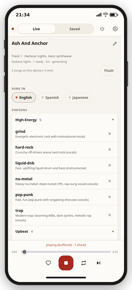
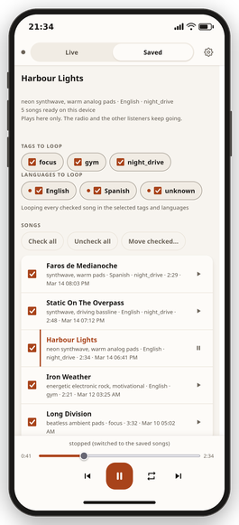
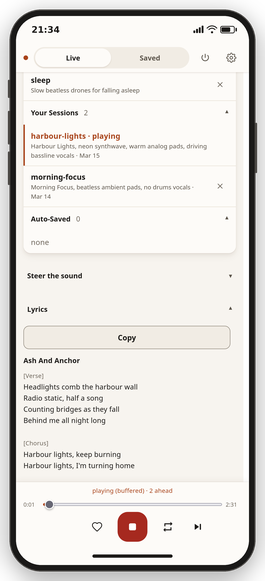
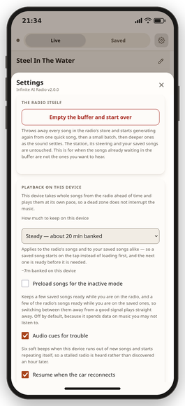
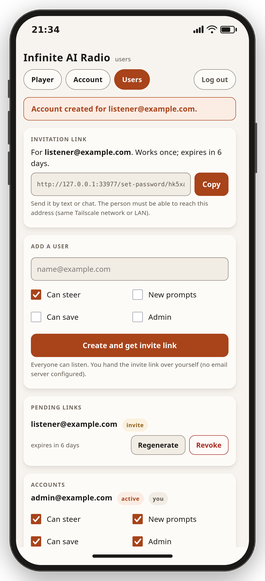

# Infinite AI Radio

Endless AI-generated music, made on your own machine. Start it and music
plays. Type plain English while it plays - "calmer", "add vocals about
winning", "switch to piano" - and the stream follows. No cloud, no API
keys, no subscriptions, nothing leaves the machine.

It is one Go binary that manages everything else: it installs the music
model, supervises it, buffers songs ahead of playback, joins them with
crossfades, and keeps audio flowing when the generator hiccups. There is
a terminal interface and a phone-first web remote, so the machine can
sit in a cupboard and the radio can live in your pocket.

[](assets/remote-player.png) [](assets/remote-saved.png) [](assets/remote-lyrics.png)

[](assets/remote-settings.png) [](assets/remote-users.png) [](assets/remote-login.png)

- [What it sounds like](#what-it-sounds-like)
- [Requirements](#requirements)
- [Install](#install)
- [Running](#running)
- [Steering the music](#steering-the-music)
- [Sessions and presets](#sessions-and-presets)
- [Saving tracks and exporting MP3s](#saving-tracks-and-exporting-mp3s)
- [Listening from your phone](#listening-from-your-phone)
- [Desktop integration](#desktop-integration)
- [Configuration](#configuration)
- [Models and licensing](#models-and-licensing)
- [Troubleshooting](#troubleshooting)
- [Development](#development)
- [License](#license)

## What it sounds like

Complete songs, one take each, the audio exactly as the radio produced
it - full length, with the words written by the built-in lyric writer:

| Listen | Preset | What it is |
| --- | --- | --- |
| [nu-metal.mp3](samples/nu-metal.mp3) | `nu-metal` | heavy nu-metal, rap-sung verses into a shouted chorus, in English |
| [trap.mp3](samples/trap.mp3) | `trap` | modern trap, booming 808s and melodic rap, in English |
| [grind.mp3](samples/grind.mp3) | `grind` | energetic electronic rock, in English |
| [hard-rock.mp3](samples/hard-rock.mp3) | `hard-rock` | riff-driven arena hard rock, in Spanish |
| [pop-punk.mp3](samples/pop-punk.mp3) | `pop-punk` | fast pop-punk with a singalong chorus, in English |
| [funk-soul.mp3](samples/funk-soul.mp3) | `funk-soul` | 70s funk and soul with horns, in French |
| [liquid-dnb.mp3](samples/liquid-dnb.mp3) | `liquid-dnb` | fast, uplifting liquid drum and bass, instrumental |
| [night-drive.mp3](samples/night-drive.mp3) | `night-drive` | neon 80s synthwave, instrumental |
| [deep-house.mp3](samples/deep-house.mp3) | `deep-house` | warm groovy deep house, instrumental |

Reproduce any of them with `iar export --songs 1 --preset <name>` (the
Spanish and French takes add `--language es` / `--language fr`) - you
will get a different song, because every generation is its own roll of
the dice.

## Requirements

Infinite AI Radio is one static binary with no libraries to install
beside it. Almost everything below is about the **music engine** it
manages for you: that engine is a Python program the binary downloads,
installs into your home directory and supervises, and it is the part
that wants a graphics card and a few ordinary system tools.

**To run it**

- Linux with PipeWire or PulseAudio - playback goes through `pw-play` or
  `pacat`. No other platform is supported yet.
- An NVIDIA GPU with 8 GB or more of VRAM, and a reasonably current
  driver. Without one the music engine is impractically slow, though the
  noise modes (pink, white, brown) still work on any machine. The engine
  installs its own CUDA build of PyTorch, so there is no CUDA toolkit to
  set up yourself.
- About 20 GB of disk space for the engine and the model weights.
- `ffmpeg` (built with libmp3lame) and its `ffprobe`, plus `git`, `curl`
  and a C compiler. `iar setup` uses them once to fetch and build the
  engine's Python dependencies; the player keeps using `ffmpeg`
  afterwards for MP3 encoding. Everything else, including the engine's
  own Python, is installed into your home directory without sudo.
- A local [Ollama](https://ollama.com) daemon with a small
  instruction-following model installed. Two of the radio's voices run
  on it: the steering interpreter, which turns what you type into
  structured, validated changes to the sound, and the lyric writer,
  which pens every vocal song's words before the music engine ever
  wakes. See [Running with less](#running-with-less) if you cannot run
  one.

`iar doctor` names anything missing. On Debian and Ubuntu, `make deps`
installs the lot with `sudo apt-get install -y`; on other distributions
use your own package manager.

**To build it from source**

- Go 1.26 or newer, and nothing else. The presets, the phone remote's
  entire interface and the pronouncing dictionary are compiled into the
  binary. You can skip this by [downloading a release](#install).

**Optional**

- [Tailscale](https://tailscale.com), to reach the phone remote from
  outside the machine.

### Running with less

Every piece above is what full-quality songs are made of, but the radio
degrades gracefully rather than refusing to play:

- **No Ollama**: steering falls back to a built-in deterministic
  interpreter, and the music engine's own planner invents each song's
  words from the theme. Everything works; the lyrics are noticeably
  simpler than the lyric writer's.
- **No GPU**: the noise modes (pink, white, brown) are synthesized by
  the player itself and run anywhere; music generation is impractically
  slow without a card.

## Install

A static binary for `linux/amd64` and `linux/arm64` is published on the
[releases page](https://github.com/zoffixznet/infinite-ai-radio/releases), with a
`SHA256SUMS` file beside it:

```sh
tar xzf iar_1.0.0_linux_amd64.tar.gz
cd iar_1.0.0_linux_amd64
./iar setup      # one-time: install the music engine and download models (~18 GB)
./iar
```

Or from source:

```sh
make deps        # check system tools (Debian/Ubuntu: installs missing ones)
make build       # build ./iar
make setup       # same one-time engine and model install
make install     # optional: copy the binary to ~/.local/bin
```

`setup` is resumable - if the download is interrupted, run it again and
it continues where it stopped. It never uses sudo. The examples below use
`./iar`; once the binary is on your `PATH` it is just `iar`.

## Running

```sh
./iar
```

That is all. Setup banks a few starter tracks, so a launch begins playing
within seconds and crossfades to freshly generated music as soon as it is
ready. A bare `./iar` starts on the `nu-metal` preset; `default_preset`
in the [configuration](#configuration) picks a different one.

The best way to drive the radio is the **web interface** - the station
picker, live lyrics, per-song saving, seeking and buffered playback all
live there, and it beats the terminal even on the machine itself:

```sh
./iar remote setup   # once: create your login (email + password)
./iar --remote       # start the radio with the web interface on
```

Open the printed URL - `http://localhost:8246` on the same machine, or
the Tailscale address from your phone ([Listening from your
phone](#listening-from-your-phone) has the full flow). `--remote`
starts the machine as a silent station; type `volume 80` in its
terminal to also hear it locally, or just run `./iar` plus `"remote":
{"enabled": true}` in the configuration to have speakers and web
together.

The other flags:

```sh
./iar "dark techno"          # start straight from a prompt
./iar --preset lofi-study    # start from a built-in preset
./iar --session gym-grind    # resume a saved session
./iar --engine noise         # noise only, no GPU needed
./iar --telemetry            # add a CPU, memory and graphics-card readout
./iar --plain                # line-based interface (used automatically in pipes)
./iar presets                # list the built-in presets
./iar doctor                 # check your environment
./iar engine stop            # stop the engine now and free GPU memory
```

Quit with `quit` or Ctrl+C. Only one player runs at a time; a second one
refuses to start and says so.

The engine is woken only when there is work: songs are planned and
rendered in batches to a disk buffer, and between batches the engine
shuts down completely, giving back all of its graphics and system memory
while playback continues from the buffer. A relaunch with a healthy
buffer plays immediately without touching the graphics card at all.

## Steering the music

While music plays, type what you want and press Enter:

```
make it more energetic
calmer
switch to piano
add vocals about winning
no vocals
generate pink noise
```

The player switches to the newly steered sound as soon as the first
track matching it is generated - with a warm engine that is typically
tens of seconds, not the end of the current track.

Steering has real semantics, not just word-appending:

- "less guitars" dials guitars down a notch without banishing them
  (repeat it to go further); "no drums" (or "without", "remove",
  "drop") removes the thing everywhere and tells the model to avoid it
  from then on; "more synths" (repeatable) raises the emphasis.
- Mood words replace their opposites: "calmer" also withdraws
  "energetic" if you asked for that earlier.
- "120 bpm", "faster", "slower", "in C minor", "3/4 time" and
  "vocals in Spanish" set tempo, key, meter and vocal language as hard
  constraints the engine honours directly.
- Repeating a request already in effect changes nothing (and says so)
  instead of churning the queue.

Steering accumulates: "calmer" then "no drums" gives you calm, drumless
music. `clear` wipes the accumulated steering and returns to the
session's base sound, and `new <prompt>` starts a fresh session from a
prompt.

### Lyrics

Vocal tracks get their words from a pluggable lyric writer; two are
built in:

- `scribe` (the default) plans each song before writing it: it pins the
  theme down to concrete images, gives every section its own job and its
  own rhyme sound, writes one section at a time, and checks every draft
  against a pronouncing dictionary - syllable counts, rhyme schemes,
  clichés, repetition budgets and theme coverage - sending corrections
  back for anything that fails. The dictionary machinery is
  English-only; in any other sung language scribe writes in one pass.
- `smoothbrain` writes each song from one quick prompt: no plan, no
  revision. Faster and much simpler; pick it when you want words on a
  budget.

`lyrics` shows the active writer, `lyrics smoothbrain` switches, and the
choice is saved with the session. Lyric writing runs through Ollama;
without a daemon the engine's own planner invents words from the theme
instead.

Songs are named from their own words, in the same breath as the words
are written - before the song is planned, rendered or heard. The name
travels with the song into the plan, onto the disk beside the audio,
and out to every screen, so a song is never nameless and never renames
itself while you are listening to it. A song whose words the engine
invented (the opener after a change, when nothing is written ahead yet)
takes a name from its own description instead, and keeps it. The only
thing that ever changes a name afterwards is you, with the pencil.

### Sung languages

Left alone, the engine sings in whatever language it feels like. Two
separate things decide otherwise:

```
languages English, Russian, French, Bisaya (Cebuano)   # what your radio offers
languages +Russian     # this session sings Russian
languages -Russian     # ...and now it does not
languages none         # this session asks for no language; the engine picks
```

The **offered list** is your radio's, saved in the configuration and
unchanged by anything you play. **Which of them a session sings in**
belongs to the session, exactly like its prompt: `gym-grind` can be
Tagalog-only and `night-shift` Russian-only, and switching between them
gives you each one's music. Editing the offered list therefore changes
nothing that is playing - it only changes what you can switch on next.

Because the languages are part of the session, changing them branches
it, the same as a steer: what you had keeps its name, the change plays
on under a new one. A session that names no language sings in whatever
the engine picks - which is what you get from a preset that carries no
language of its own; one that does (most of the vocal presets say
English) starts its session singing that, and the switches show it.

If you take a language out of the offered list while a session sings in
it, the session goes on singing it: it was saved that way. That
language's switch stays visible, marked as one your radio no longer
offers, so you can turn it off - and once you do, it is gone from the
list. The phone shows those in a different colour.

Languages the engine has no tag for still work best-effort (the words
are written in that language and sung without a language hint), and the
`languages` listing says which ones those are. Steering a language by
hand ("sing in French") pins the session to it; flipping a switch
releases the pin and drops the tracks queued ahead.

### Terminal commands

Besides steering text, the terminal interface takes the commands below,
typed at the same prompt. A leading slash is optional: `skip` and
`/skip` do the same thing.

| Command | Effect |
| --- | --- |
| `clear` | wipe the steering context |
| `new <prompt>` | fresh session from a prompt |
| `save [prev] [tag]` | save the playing (or previous) track as MP3, filed under a tag |
| `name <name>` | save the current session under a name |
| `sessions` | list presets and saved sessions |
| `load <name>` | resume a saved session |
| `preset <name>` | switch to a built-in preset |
| `delete <name>` | delete a session or hide a preset (asks first) |
| `delete autos [days]` | delete the sessions nobody named (asks first) |
| `mp3 <minutes> [file]` | export minutes of the current vibe to MP3 |
| `skip` | jump to the next track |
| `loop` | repeat the playing track until toggled off |
| `pause` / `resume` | pause or continue output |
| `standby` | hold the whole radio: nothing plays, nothing is generated |
| `volume <0-100>` | set output volume |
| `lyrics [name]` | show or switch the lyric writer |
| `languages [list]` | show or set the offered languages; `+X`/`-X`/`none` switch this session's |
| `status` | engine, buffer and session status |
| `help` | list commands |
| `quit` | exit |

### Standby

`standby` puts the radio to sleep without stopping it. Nothing plays,
and - the point of it - nothing is generated: the buffer stops being
consumed and stops being refilled, so a machine left running overnight
sits idle with a full buffer instead of rendering songs nobody is
awake to hear. `standby` again wakes it, playing from exactly where it
left off and generating again once the buffer runs down. The hold is
remembered across restarts, so a radio put on standby comes back up on
standby.

The phone remote has the same switch under **Settings -> The radio
itself**, and a held radio says so in a banner across the top of the
page that cannot be scrolled past. Ticking it also stops that device
listening. A phone in buffered mode holds songs of its own, so pressing
play into a held radio is allowed but warns, in the banner, that the
music runs out when this device's own songs do; the banner's *Wake*
button clears the hold for everyone.

## Sessions and presets

Everything you type is persisted automatically; you never have to save,
and a restart carries on with the session that was playing rather than
starting something new. `name gym-grind` gives the current session a
name, and `./iar --session gym-grind` (or `load gym-grind` inside)
brings that vibe back at any time. Session files are plain JSON in your
data directory.

**Changing the sound branches the session.** A steer, a language switch,
a different lyric writer, `clear` - anything that changes what is being
generated - leaves the sound you had under its own name and carries on
under a new one, named after where it came from
(`gym-grind-20260904-231500`). If the change is not an improvement,
`load gym-grind` puts the old sound back and you can try something else
from there. The acknowledgment names the session it kept, so you never
have to go looking. Changes made before anything has been heard - three
steers while the first track is still rendering - stay in one session
rather than leaving a trail of sounds nobody heard.

A session you named and one that was named for you work the same way in
every respect: both resume, both can be loaded, both are listed. The one
difference is that the generated ones accumulate - one per change - so
there is a single gesture that clears them out: `delete autos` in the
player, *Delete all* on the phone's **Auto-saved** band, or
`./iar sessions delete-auto` from a shell. `delete autos 7` (or
`--older-than-days 7`) keeps the recent ones. Whatever is playing, and
anything you named, is never touched. `sessions` lists everything.

Twenty-one presets ship built in, grouped by energy - pick a feeling first
and steer the genre later. They behave like read-only sessions: starting
one seeds a fresh session you can steer and name.

| Group | Presets |
| --- | --- |
| high-energy | `grind` · `hard-rock` · `liquid-dnb` · `nu-metal` · `pop-punk` · `trap` |
| upbeat | `chiptune` · `deep-house` · `funk-soul` · `sunshine-pop` |
| cruise | `boom-bap` · `epic-score` · `night-drive` · `reggae-dub` · `roadhouse-country` |
| chill | `chamber-strings` · `deep-focus` · `jazz-club` · `lofi-study` |
| sleep-noise | `pink-noise` · `sleep` |

`./iar presets` describes each one. A preset can be deleted like a
session; `./iar sessions restore-presets` brings them all back.

## Saving tracks and exporting MP3s

When a track lands just right, type `save` and it is written as a
high-quality MP3 into the snippets folder, with the song's title, genre
line and lyrics in its tags. `save prev` captures the previous track for
when it clicks a moment too late; `save gym` files it under a tag, and
tags become folders (`snippets/gym/`). Saving never interrupts playback,
and saving the same track twice is a friendly no-op.

`mp3 20` renders a mix of the current vibe in the background,
generating only while the playback buffer is full, so the stream never
stutters. Exports are made of whole songs, never cut mid-song - a
vocal song runs as long as its words call for, an instrumental for
`track_seconds` - so a 20-minute ask may run up to one song longer. The same thing works
headless, where `--songs` renders an exact count instead and
`--language` picks the sung language:

```sh
./iar export --minutes 20 --preset sleep
./iar export --songs 1 --preset nu-metal --out banger.mp3
./iar export --songs 3 --preset hard-rock --language es
./iar export --minutes 30 --session gym-grind --out ~/Music/grind.mp3
```

A headless export works exactly like the radio: the lyric writer pens
every vocal song's words while the graphics card is still free, then
the engine wakes and plans and renders them. Exports are capped at 180
minutes or 40 songs per run.

## Listening from your phone

The web remote is a phone-first page with the live stream, the
now-playing song and its words, the shared steering context, a station
picker, save buttons, and a player for the songs you have saved.
Everything needs a login, and the first account is created in the
terminal:

```sh
./iar remote setup   # create the first admin (email + password)
./iar --remote       # start as the station: remote on, local speakers at 0
```

With `--remote` the machine is the station, not the listening room -
type `volume 80` in its terminal to also hear it locally. The player
prints the URL to open; the stream is MP3 at ~192 kbps. Like everything
else it sits behind the login, so a non-browser player needs the session
cookie passed along to read `/stream.mp3`. The page can be installed as
an app from the browser menu ("Add to Home screen").

For safety the remote binds only to localhost and, when the machine has
one, its Tailscale address - never your LAN or the internet unless you
add addresses to `remote.bind`. The intended setup is a private
[Tailscale](https://tailscale.com) network:

1. Install Tailscale on the computer (needs sudo) and sign in.
2. Install the Tailscale app on the phone, same account.
3. `./iar remote setup`, then `./iar --remote`.
4. Open the printed `http://100.x.y.z:8246` URL on the phone, log in,
   tap play.

To also reach it on your home LAN, add the machine's address to
`remote.bind` (`"bind": ["0.0.0.0"]` listens everywhere the machine
is):

```json
{ "remote": { "enabled": true, "bind": ["192.168.1.20"] } }
```

Security, plainly:

- Logins happen over plain HTTP. Tailscale encrypts everything between
  the devices, so that is fine on the tailnet; on your own LAN it is
  your call. Never expose the port to the public internet without TLS
  in front of it - behind such a proxy the login cookie is marked
  secure automatically.
- A login lasts 30 days of inactivity (it is a radio). Changing or
  resetting a password logs every other device out.
- Failed logins are rate-limited per address and per account, and the
  page never reveals whether an email exists.
- Requests whose Host or Origin is not an address the remote listens on
  (or an entry in `remote.allowed_hosts`) are refused - a cross-site and
  DNS-rebinding defense.

### On the phone

The page defaults to **buffered playback**: it downloads whole upcoming
tracks and plays them back-to-back, so the music keeps going through
minutes of dead signal. How much is buffered is a per-device choice
under Settings, from one track ahead on metered connections to about 45
minutes - or, on the Ultra setting, about three hours for a flight or
a long dead zone (a phone that runs out of room says so rather than
failing quietly). In buffered mode the Next button skips only on that
device; other listeners and the machine keep their own position. A
Settings switch selects the direct live stream instead - the one
`/stream.mp3` serves - whose Next skips for everyone. The Loop button
works the same way: when a track is a keeper, tap it and the song
repeats until you tap again - on this device alone in buffered mode,
for the whole radio (speakers, stream and all) on the direct stream.
Skipping, steering or changing the session turns the loop off, since
each of those means "move on".

A seek bar sits under the now-playing song: buffered songs are whole
files on the device, so you can jump anywhere in them; the direct
stream, like any live stream, has no rewind and shows just the clock.
Below it the page counts what is banked on this device, and the *Flush*
button next to that count dumps the bank and rejoins the live stream at
its edge. If the stream drops or stalls, the page reconnects on its own
and picks up the moment the stream is reachable again; only an expired
login stops it.

**Audio cues for trouble** are on by default. A radio that quietly
repeats itself looks exactly like a radio that is working, so when the
music stops arriving and the same song comes round again, the sound
ducks for three soft beeps and comes back. It repeats at most every few
minutes, and switching it off in Settings is one tap.

Saving from the phone captures what *you* are hearing - in buffered mode
that is this device's track, which may trail the machine's speakers.

The pencil beside the song's name renames it, so a name you disagree
with can be fixed while the song is still playing instead of from the
saved list, which means leaving the live page and stopping the radio.
The new name is the last word: it replaces the name everywhere the song
is kept - the queue other devices read, the copy banked for instant
starts, the song still waiting on disk. If you had already saved that
song, its file is renamed on disk too, tag and all.

The page publishes media-session metadata, so lock screens, Bluetooth
displays and car interfaces show the song's title and genre line with
working play, pause and next buttons. Browsers refuse to autoplay on an
untouched page, so after a reload the next tap anywhere starts the
audio. Installing the page as a web app removes even that, though only
over HTTPS; on the plain `http://` tailnet address the one-tap start is
how it works.

Two car conveniences live under Settings, remembered per device:

- **The previous-track button saves the track.** An endless stream has
  no meaningful "previous", so that button - on the steering wheel,
  headset or car screen - doubles as save-what-I-am-hearing, confirmed
  by a "Saved:" flash in the title. It captures every previous-track
  input, a voice assistant's "previous song" included. In the
  saved-songs player, previous keeps its normal meaning.
- **Resume when the car reconnects.** When the car turns off, playback
  pauses and resumes by itself when the car asks to play again - never
  on a timer, so a phone in a pocket stays silent. Hands-free resume
  may need Android Auto's "Automatically resume media" setting, and
  after a long stop the phone's battery management can require one tap.

### Saved songs

The remote's **Saved** mode plays your saved songs entirely on the
phone; the live stream and the machine's speakers are untouched. Tick
the tags and sung languages you want and it loops through the checked
songs forever; uncheck a song to skip it without deleting anything, or
loop just one. Tapping a row opens the song's panel: full lyrics,
details, and buttons to download, rename, move or delete it. Renaming
here works the same way as the pencil on the live page: the file and
its title tag both change.

On disk, a saved song's file is named after its title with the sung
language's tag before the extension
(`20260101-120000-tumutunaw-ang-selyo.tl.mp3`), and the full lyrics sit
next to the MP3 in a `.txt` with the same base name.

### Accounts and permissions

Every listener has an account; the email address is the login, and only
the account holder ever knows the password. Admins manage everything on
the **Users** page: adding a user produces a one-time invitation link
(expires in 7 days) to send by text or chat - the person opens it,
chooses a password, and is in. The link carries the address you created
it from, so make it from a browser on the same route the invitee will
use (the tailnet address for tailnet users, the LAN address for LAN
users). Four independent permission switches per
account: *admin* (manage users, delete sessions and saved songs, edit
the language list), *can steer*, *new prompts* (start prompts, load
sessions and presets), *can save*. Listening needs none of them. The
page only shows the controls an account may use, and the server refuses
the rest either way.

Password resets are one-time links an admin hands out (24 hours, the
user picks the new password). You cannot delete your own account, and
the last admin can neither be deleted nor demoted; a locked-out sole
admin recovers with `./iar remote setup` in the terminal. Accounts live
in owner-only JSON files under the data directory.

Optionally, point `remote.smtp` at any mail provider and invitation and
reset links are emailed as well; `./iar remote test-email
you@example.com` checks the setup. With no email configured you pass
links on yourself, and nothing is missing.

```json
{ "remote": { "smtp": {
    "host": "smtp-relay.example.com", "port": 587, "tls": "starttls",
    "username": "your-login", "password": "your-smtp-key",
    "from": "radio@example.com" } } }
```

## Desktop integration

Infinite AI Radio appears as a regular MPRIS media player, so media
keys, KDE's media controls, KDE Connect and `playerctl` all work:

```sh
playerctl --player iar play-pause
playerctl --player iar metadata xesam:title
```

## Configuration

Configuration is optional: the player runs with none at all. To tune
it, create a JSON file at the path shown by `iar doctor` (usually
`~/.config/iar/config.json`) with only the keys you want to change;
everything else keeps its default. The complete set, with defaults:

```json
{
  "engine": "acestep",
  "player": "auto",
  "track_seconds": 150,
  "crossfade_seconds": 3,
  "buffer_tracks": 6,
  "volume": 80,
  "bed_while_waiting": false,
  "pipe_latency_ms": 200,
  "normalize_loudness": true,
  "mp3_quality": 0,
  "snippets_dir": "",
  "library_max_mb": 600,
  "lyrics_generator": "scribe",
  "vocal_languages": [],
  "default_preset": "nu-metal",
  "remote": {
    "enabled": false,
    "port": 8246,
    "bind": [],
    "allowed_hosts": [],
    "smtp": {
      "host": "",
      "port": 0,
      "username": "",
      "password": "",
      "from": "",
      "tls": "starttls"
    }
  },
  "acestep": {
    "port": 0,
    "idle_minutes": 15,
    "lm_model_path": "",
    "lm_backend": "auto",
    "inference_steps": 12,
    "thinking": true,
    "offload_dit": false,
    "max_track_seconds": 300,
    "repo_url": "https://github.com/ace-step/ACE-Step-1.5",
    "tag": "v0.1.8"
  },
  "buffer": {
    "phased": true,
    "render_low_minutes": 45
  },
  "ollama": {
    "enabled": true,
    "gpu_layers": 0,
    "url": "http://127.0.0.1:11434",
    "model": ""
  },
  "sessions": {
    "auto_retention_days": 2
  }
}
```

### Top level

- `engine`: `"acestep"` (AI music, default) or `"noise"` (pure noise
  synthesis, no GPU needed). The `--engine` flag overrides per run.
- `player`: `"auto"` picks the best available backend (currently the
  pw-play/pacat pipe). `"pipe"`, `"null"` (silent, realtime-paced) and
  `"file"` (raw PCM to a file, used with `--player-file`) are mostly for
  scripting and tests. The `--player` flag overrides per run.
- `track_seconds` (30-300): the length asked for when a length has to
  be named - the short first track that gets music playing sooner, and
  MP3 exports measured in minutes. Ordinary tracks do not follow it:
  every song's length comes from the song, bounded only by
  `max_track_seconds`. A vocal track's length follows its words, and an
  instrumental's is chosen by the engine's planner to suit the piece.
- `crossfade_seconds` (0.5-10): equal-power crossfade between tracks.
- `buffer_tracks` (1-8): only used when `buffer.phased` is false - how
  many finished tracks the in-memory queue keeps ahead of playback
  (about 28 MB per 150-second track). With phased generation (the default) the queue ahead of
  playback lives on disk instead (see the `buffer` section) and phone
  listeners prefetch straight from it, so this setting is not used.
- `volume` (0-100): initial output volume. Starting the player with the
  `--remote` flag overrides this to 0 - a machine started as the
  station should not blast music into its own room. Turn the local
  speakers up any time with the `volume` command; remote listeners
  always get the full-level stream regardless (it is tapped before the
  volume control). Enabling the remote through the config file alone
  does not silence anything.
- `bed_while_waiting`: when true, a quiet noise bed plays while the
  first track is prepared instead of the default silence-with-progress.
- `pipe_latency_ms` (20-2000): how much buffering the system audio
  player is asked for. Larger values ride out heavy system load at the
  cost of a slightly slower response to volume/pause.
- `normalize_loudness`: level every generated track to a consistent
  loudness (peak-safe) before playback and banking.
- `mp3_quality` (0-9): libmp3lame VBR quality for exports, snippets
  and - under phased generation, the default - the songs stored in the
  disk buffer, which are decoded back for playback. 0 is best (the
  default), 9 is smallest; raising it shrinks the disk buffer at the
  cost of playback quality.
- `snippets_dir`: where the `save` command writes captured tracks, one
  subdirectory per tag (`untagged/` for saves without one). Empty means
  `snippets/` under the data directory.
- `library_max_mb`: total size cap for the on-disk track library that
  powers instant starts (0 disables the library).

- `lyrics_generator`: which lyric writer pens the words on vocal
  tracks: `"scribe"` (default; plans, drafts and revises against
  dictionary-checked rhyme, syllable, repetition and topic rules) or
  `"smoothbrain"` (a quick one-shot prompt). This sets the
  default for new sessions; the `lyrics` command and the phone remote
  switch it per session at runtime. Lyric writing uses Ollama; without
  a daemon the engine's own planner invents the words.
- `default_preset`: the preset the radio starts on when you run `iar`
  with no `--preset`, `--session` or prompt. Empty starts from the
  built-in fallback sound instead. A name that no longer exists is
  logged and falls back rather than stopping the radio.
- `vocal_languages`: the languages your radio offers for sung vocals,
  written the way you would say them: `["English", "Russian",
  "French", "Bisaya (Cebuano)"]`. This is the list to pick from, not
  the choice itself: which of them a session sings in is saved with the
  session, so loading one sings what it was saved with. A session that
  names none - and the default, an empty list - leaves the choice to
  the music engine. Each song picks one of the session's languages at
  random, so the same one can come up twice in a row. The `languages`
  command and the phone remote's Settings edit this list and write it
  back here; `languages +Russian` and the switches on the Live screen
  change the session instead.
  The music engine publishes about fifty language tags but never checks
  a request against the list, and the model behind it knows more
  languages than the list names - Cebuano among them, asked for by its
  own tag. Anything it does not know still works: the words are written
  in it and sung with no tag at all. On tracks where the engine writes
  the words itself, the tag decides which language they are written in,
  so a near-miss tag gets a different language rather than an accent.
  A language steered in by hand ("sing in
  French") pins the session to it and outranks its list; a preset that
  names a language of its own seeds the list instead, so the switches
  show it. Flipping a switch releases that pin, drops the tracks queued
  ahead and starts generating in the new languages.
- `vocal_languages_off` is no longer used. Which languages are sung
  lives in the session now, so that loading one sings what it was saved
  with; sessions written before that are converted the first time they
  are loaded. The key can be deleted.

### remote

The phone remote (page + live MP3 stream + saved-songs player); see [Listening from your phone](#listening-from-your-phone) for the
full flow. Every
request needs a logged-in account (`iar remote setup` creates the first
admin; the Users page does the rest).

- `enabled`: turn the remote on (the `--remote` flag does the same for
  one run).
- `port`: the HTTP port (default 8246).
- `bind`: extra addresses to listen on, as a list (a plain string also
  works and means a one-element list). Binding is additive: localhost
  and the machine's Tailscale address are always kept, and every
  address you bind is automatically accepted in URLs. `"0.0.0.0"`
  listens on every network the machine is on and auto-allows the
  machine's own interface addresses. Remember that logins travel in
  clear text over plain HTTP: fine on the tailnet (encrypted), your
  call on a home LAN, never on the public internet without TLS in
  front.
- `allowed_hosts`: extra hostnames or IPs clients may use in the URL
  (the remote rejects unknown Host and Origin values as a
  DNS-rebinding/cross-site defense). Localhost, the tailnet address and
  bound addresses are always allowed; you only need this for a
  hostname or a reverse proxy.
- `smtp`: optional. When `host` is set, invitation and password-reset
  links are also emailed to their recipients (without it, admins pass
  the links on by hand). `tls` is `"starttls"` (default, port 587),
  `"tls"` (implicit TLS, port 465) or `"none"` (port 25); `port`
  overrides the default for the mode; `username`/`password`
  authenticate with PLAIN when set; `from` is the sender address. Test
  with `iar remote test-email you@example.com`. A config file holding
  the password should be readable only by you (`chmod 600`).

### acestep

Settings in this section are read when the engine daemon starts. Under
phased generation (the default) the radio stops and restarts the daemon
around every batch, so an edit here is picked up within a cycle on its
own; with `buffer.phased` off, the daemon outlives sessions and an
`iar engine stop` is needed for changes (and after flipping
`buffer.phased` itself, so the daemon restarts with the matching
disk-backing mode).

- `port`: pins the engine API to a fixed localhost port. The default 0
  allocates a free port for each engine daemon (the port is recorded in
  the state directory and shown by `iar engine status`).
- `idle_minutes`: the shared engine daemon shuts down after this long
  with nothing using it, freeing GPU memory. Restarting the player
  within the window reuses the warm engine instantly. Under phased
  generation (the default) the daemon is stopped at the end of every
  cycle anyway, so this is only a backstop for one left running by an
  interrupted run.
- `lm_model_path`: pins the engine's internal planner language model
  (e.g. `"acestep-5Hz-lm-0.6B"` or `"acestep-5Hz-lm-1.7B"`). Empty lets
  the engine pick one that fits your GPU.
- `lm_backend`: `"auto"` (default) runs the planner LM in a
  memory-friendly way (PyTorch backend, released from GPU memory between
  generations) on GPUs under 16 GB, and leaves the engine's faster vLLM
  default on larger ones. `"vllm"` or `"pt"` force a backend. If you see
  CUDA out-of-memory errors because other applications share the GPU,
  `"pt"` is the safe choice.
- `inference_steps` (1-20): diffusion steps for the turbo model. The
  default 12 renders audibly more high-end detail than the model's
  quick-start 8; on a strong GPU the speed difference is negligible
  because planning and decoding dominate generation time. 20 adds a
  little more brightness.
- `thinking`: when true, the engine's planner LM sketches the track
  before synthesis, which improves musical coherence at some speed cost.
- `offload_dit`: only used when `buffer.phased` is false. Under phased
  generation (the default) the music model is already streamed from
  disk and released between cycles, so this setting changes nothing. With `buffer.phased` off:
  when true, the music model is kept in system memory
  between tracks instead of staying resident on the graphics card. Turn
  it on when something else needs the card - a speech-to-text model, a
  game, another generator. The radio only computes for about a fifth of
  the time it runs, so this hands roughly four and a half gigabytes of
  video memory back for the rest of it. It costs a few seconds per
  track while the weights move back, and about the same amount of
  system memory to hold them; the music itself is identical. It does
  not lower the peak during generation, so it fixes the collisions that
  happen between tracks, not the ones during them.
- `max_track_seconds`: a ceiling on track length, however the length
  was decided - derived from a written lyric sheet, or picked by the
  engine's planner for an instrumental or a song it wrote the words
  for. Every path produces natural song lengths, typically three to
  four minutes. Longer plans cost proportionally more video memory and
  generation time, so the ceiling trims the occasional runaway pick
  without shortening normal songs; picks under the ceiling pass
  through untouched. 0 removes the ceiling.
- `repo_url`, `tag`: which engine version `iar setup` installs. Change
  only if you know you want a different release.

### buffer

Phased generation, the default way music is produced: every model gets
the graphics card in turn, and none of them ever fights another for
it. A cycle begins before the engine wakes, with the card still free:
the lyric helper writes the coming batch's words there and names and
describes each song from them in the same breath (the wordsmith phase).
The writer keeps the card until every planned song has its own words,
yielding early only to a steer, an export, or the rendered buffer
decaying to its starve floor - and planning never outruns it: a batch
that empties the shelf pauses, renders what is already planned, and
hands the card back to the writer for the next round. With the buffer
starved the phase writes a single song's words so first audio is never
kept waiting, and it skips entirely when the engine was left warm.
Then the engine wakes and plans the batch (planner
alone on the card, the audio model dropped entirely, the pre-written
words consumed as-is), renders it from the planned audio codes (audio
model alone, streamed from disk), stores the songs on disk under the
data directory, and shuts down completely - between cycles the engine
holds no video memory and no system memory at all. Playback feeds from
the disk buffer.

Batch sizes climb a ladder as un-steered listening proves the context
settled: one opener as fast as possible (engine-invented words
allowed), a ten-song audition of songs with the writer's own words,
then batches of 20, 40 and 80 - the ceiling; each refill from there is
another 80-song batch. The rungs unlock on played songs that carried
written words, so the audition is of the quality the deep batches will
have. A cycle renders everything it plans and hibernates; the next
batch starts when the rendered buffer runs down to `render_low_minutes`
of audio left. A steer drops every stored plan and song and restarts
the ladder, so trying prompts never wastes deep work - but a restart
of the player does not: the buffer carries a context and a build
stamp, continues across restarts of the same binary, and is cleared
when a different build of the player takes over, so songs rendered by
older code never linger into an upgrade. `iar buffer clear` resets it
by hand.

- `phased`: turns the split pipeline on (the default). false restores
  the fused path: each track generated in one engine job with the audio
  model resident the whole time.
- `render_low_minutes` (5 or more): the refill trigger; when the
  rendered buffer runs down to this much audio left, the next batch
  starts. Out-of-range values are clamped at load.

### ollama

- `enabled`: when true and a daemon is reachable, the player asks Ollama
  to refine steering inputs into structured, validated updates to the
  sound, to enrich vague starting prompts, and to write lyrics for
  vocal tracks. All of it happens in the background and only shapes
  later tracks; the deterministic built-in path handles every input on
  its own, so when Ollama is off or unreachable everything still works.
- `url`: daemon address.
- `model`: model name to use; empty picks the first installed model.
  Pin a small, fast instruction-following model here; it is plenty for
  this job and keeps the refinements timely.
- `gpu_layers`: how much of the helper model may go onto the graphics
  card. The default 0 follows the music engine: while a generation
  cycle holds the card the helper stays entirely on the CPU - a helper
  load grabbing leftover memory mid-generation is exactly what pushes
  the card into out-of-memory - and the moment the engine hibernates,
  the Ollama daemon places the model on the freed card, where lyric
  and naming calls take seconds instead of minutes. Set -1 to always
  let the daemon place the model (sensible on a machine with video
  memory to spare), or a positive number to always put that many
  layers on the card.

### sessions

- `auto_retention_days`: sessions that were never given a name (the
  `session-...`, `prompt-...` and `<preset>-...` ones saved
  automatically) are deleted this many days after they last played, at
  startup and every half hour while playing. The default, `0`, keeps
  them: they are the sounds you go back to when a change did not work
  out, so clearing them is a decision (`delete autos`) rather than a
  timer. Named sessions, presets and the playing session are never
  touched.

### Environment variables

- `IAR_DATA_DIR`: relocates all state (engine install, sessions, exports,
  logs). Defaults to `$XDG_DATA_HOME/iar` or `~/.local/share/iar`.
- `IAR_CONFIG_DIR`: relocates the config file. Defaults to
  `$XDG_CONFIG_HOME/iar` or `~/.config/iar`.

### Data layout

Inside the data directory:

- `engine/` - the music engine checkout, its Python environment and model
  checkpoints
- `sessions/` - one JSON file per saved session, plus `deleted-presets`
  (the list of presets hidden with `iar sessions delete`)
- `library/` - banked tracks for instant starts (size-capped)
- `buffer/` - phased generation's disk buffer: `plans/` (small JSON song
  plans), `tracks/` (rendered MP3s, each with a JSON metadata sidecar),
  and the stored steering context. The largest directory after `engine/`
  and `library/`; how much it holds follows the batch ladder
- `snippets/<tag>/` - tracks captured with the save command, one
  directory per tag (`untagged/` when none was given)
- `remote/` - the phone remote's accounts and login sessions
  (`users.json`, `sessions.json`; owner-only)
- `exports/` - MP3 exports
- `logs/iar.log` - structured JSON log of the player
- `logs/engine-daemon.log` - the shared engine daemon's log
- `state/` - engine daemon state, locks, phase-duration records, and
  the `standby` marker when the radio was left held

## Models and licensing

The code is MIT licensed. Model weights are never bundled: `iar setup`
downloads them from their publishers into the player's data directory,
with visible progress, and the default path needs no account, token or
license click-through.

**ACE-Step 1.5, the music engine.** The code lives at
[github.com/ace-step/ACE-Step-1.5](https://github.com/ace-step/ACE-Step-1.5)
(MIT, pinned to a release tag by `iar setup`); the weights at
[huggingface.co/ACE-Step/Ace-Step1.5](https://huggingface.co/ACE-Step/Ace-Step1.5)
(MIT, ungated, about 10 GB: the turbo diffusion model, a 1.7B planner
language model, a Qwen3 text embedder and the audio VAE). Setup also
fetches the smaller 0.6B planner from
[huggingface.co/ACE-Step/acestep-5Hz-lm-0.6B](https://huggingface.co/ACE-Step/acestep-5Hz-lm-0.6B)
(MIT, about 1.2 GB), which the engine uses automatically on cards with
less memory - the turbo model plus the 0.6B planner fit comfortably in
8 GB, and on cards under 16 GB the planner runs on the memory-friendly
PyTorch backend (see [the acestep section](#acestep)). Output is 48 kHz
stereo, full-song generations with optional sung vocals. The model card
states that music generated with ACE-Step 1.5 may be used commercially
(the training data is licensed, royalty-free, or synthetic); verify
current terms on the model card if this matters for your use.

The engine runs as a local API server, listening on localhost only,
managed by a daemon the player starts, supervises and restarts as
needed (`iar engine status` / `iar engine stop`). Under phased
generation - the default - the daemon is started for each generation
cycle and shut down again afterwards, so between cycles it holds no
graphics memory and no system memory at all.

**The Ollama model, the radio's other voice.** The steering interpreter
and the lyric writer run on whatever model your
[Ollama](https://ollama.com) daemon has installed - a small, fast
instruction-following model is plenty. The player never downloads
Ollama models, and whichever one you point it at keeps its own license
terms, which also apply to the lyrics it writes.

**Embedded word data.** The lyric writer embeds two small datasets in
the binary, used to check syllable counts, rhymes and vocabulary
offline: the [CMU Pronouncing
Dictionary](https://github.com/cmusphinx/cmudict) (Carnegie Mellon
University, BSD-style license; the notice ships as
`LICENSE.third-party` in binary releases and lives at
`internal/prosody/data/LICENSE` in the source tree), and an English
word-frequency list from Peter Norvig's [Natural Language Corpus
Data](https://norvig.com/ngrams/), derived from the Google Web Trillion
Word Corpus.

**Noise synthesis.** White, pink and brown noise are synthesized
directly by the player in pure Go - no model, no GPU: pink via Paul
Kellet's filter, brown via a leaky integrator. Noise serves as the
instant-start bed, the last-resort fallback when the engine is
unavailable, and a first-class mode for sleep and masking via the
`pink-noise` preset or steering ("generate brown noise").

## Troubleshooting

`iar doctor` checks system tools, the GPU, the engine install and
whether the engine is responding, and prints the path to the structured
log, which has the full story including the engine's own output.

- **"music engine not installed"** - run `./iar setup`.
- **No sound** - confirm `pw-play` or `pacat` plays something, then try
  `./iar --player pipe`.
- **The first track takes a while** - the initial model load is a few
  minutes; later launches skip it while the disk buffer is healthy.
- **Buzz or static while a track generates** - if the underrun counter
  (in the header and in `iar doctor`) stays at zero, the audio stream
  itself is clean and the noise is electrical interference induced
  after the digital output.
- **Generation failures** - the stream degrades gracefully (buffer,
  then looping the last track, then a noise bed) and the engine
  restarts itself; expect at most a couple of minutes of looped music.
  The interface and `iar doctor` show the failure streak and the last
  reason.

Known limitations: this is a background-music radio, not a songwriting
studio - you steer the vibe, the machine makes the calls - and the
phone remote has no self-service password reset; an admin hands out
reset links.

## Development

```sh
make help          # list targets
make test          # unit tests (silent; no audio devices touched)
make lint          # go vet + gofmt check
make smoke         # end-to-end test of the built binary (sandboxed, silent)
make browser-test  # the phone remote in headless Firefox
make screenshots   # re-shoot the screenshots above
make release       # build the release tarballs and checksums into dist/
```

The test suite, smoke test and browser test never make a sound: they use
the null or file audio backends, sandboxed data directories, and a
temporary null audio sink for the browser. See
[CONTRIBUTING.md](CONTRIBUTING.md) to get started.

## License

MIT - see [LICENSE](LICENSE). The pronouncing dictionary embedded in the
binary carries its own BSD-style notice; see
[Models and licensing](#models-and-licensing).
