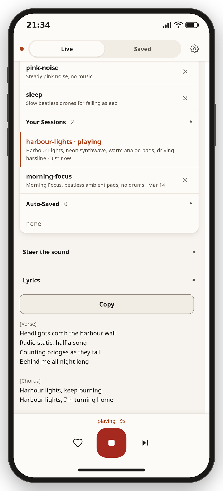
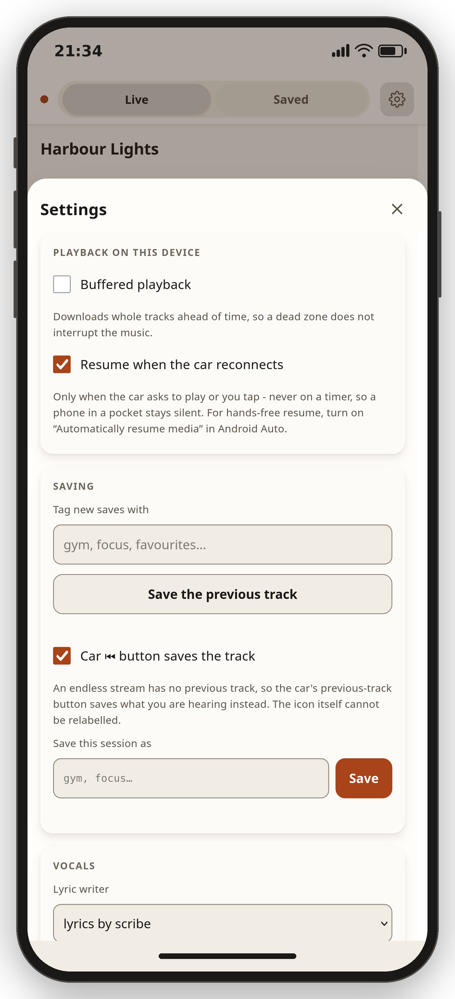

# Infinite AI Radio

Endless AI-generated music, made on your own machine. Start it and music
plays. Type plain English while it plays - "calmer", "add vocals about
winning", "switch to piano" - and the stream follows. No cloud, no API
keys, no subscriptions, nothing leaves the machine.

It is one Go binary that manages everything else: it installs the music
model, supervises it, buffers songs ahead of playback, joins them with
crossfades, and keeps audio flowing when the generator hiccups. There is
a terminal interface and a phone-first web remote, so the machine can
sit in a cupboard and the radio can live in your pocket.

<p align="center">
  <a href="assets/remote-player.png"></a>
  <a href="assets/remote-saved.png"></a>
</p>

<details>
<summary><b>More of the remote</b> - the words of the playing song, settings, listener accounts, the login page</summary>
<p align="center">
  <a href="assets/remote-lyrics.png"></a>
  <a href="assets/remote-settings.png"></a>
</p>
<p align="center">
  <a href="assets/remote-users.png"></a>
  <a href="assets/remote-login.png"></a>
</p>
</details>

## What it sounds like

Judge for yourself - these are unedited, straight from the presets they
are named after, generated by the same command you would run:

| Listen | Preset | Sound |
| --- | --- | --- |
| [lofi-study.mp3](samples/lofi-study.mp3) | `lofi-study` | chill lofi hip hop beats for studying and working |
| [night-drive.mp3](samples/night-drive.mp3) | `night-drive` | neon 80s synthwave for driving |
| [grind.mp3](samples/grind.mp3) | `grind` | energetic electronic rock, the one preset here that sings |
| [deep-focus.mp3](samples/deep-focus.mp3) | `deep-focus` | beatless ambient pads for deep concentration |
| [jazz-club.mp3](samples/jazz-club.mp3) | `jazz-club` | late-night jazz combo, warm and relaxed |

Each is 45 seconds out of a one-minute render, nothing edited but the
fade at the end. Reproduce any of them yourself with
`iar export --minutes 1 --preset <name>` - you will get a different song,
because every generation is its own roll of the dice. A weak track is
usually followed by a better one, and `skip` is always there.

## Requirements

Infinite AI Radio is one static binary with no libraries to install
beside it. Almost everything below is about the **music engine** it
manages for you: that engine is a Python program the binary downloads,
installs into your home directory and supervises, and it is the part
that wants a graphics card and a few ordinary system tools.

**To run it**

- Linux with PipeWire or PulseAudio - playback goes through `pw-play` or
  `pacat`. No other platform is supported yet.
- An NVIDIA GPU with 8 GB or more of VRAM, and a reasonably current
  driver. Without one the music engine is impractically slow, though the
  noise modes (pink, white, brown) still work on any machine. The engine
  installs its own CUDA build of PyTorch, so there is no CUDA toolkit to
  set up yourself.
- About 20 GB of disk space for the engine and the model weights.
- `ffmpeg` (built with libmp3lame) and its `ffprobe`, plus `git`, `curl`
  and a C compiler. `iar setup` uses them once to fetch and build the
  engine's Python dependencies; the player keeps using `ffmpeg`
  afterwards for MP3 encoding. Everything else, including the engine's
  own Python, is installed into your home directory without sudo.

`iar doctor` names anything missing. On Debian and Ubuntu, `make deps`
installs the lot with `sudo apt-get install -y`; on other distributions
use your own package manager.

**To build it from source**

- Go 1.26 or newer, and nothing else. The presets, the phone remote's
  entire interface and the pronouncing dictionary are compiled into the
  binary. You can skip this by [downloading a release](#install).

**Optional**

- A local [Ollama](https://ollama.com) daemon. When present, the player
  uses it to refine steering and write lyrics; without it a built-in
  deterministic path takes over and everything still works.
- [Tailscale](https://tailscale.com), to reach the phone remote from
  outside the machine.

## Install

A static binary for `linux/amd64` and `linux/arm64` is published on the
[releases page](https://github.com/OWNER/REPO/releases), with a
`SHA256SUMS` file beside it:

```sh
tar xzf iar_1.0.0_linux_amd64.tar.gz
cd iar_1.0.0_linux_amd64
./iar setup      # one-time: install the music engine and download models (~18 GB)
./iar
```

Or from source:

```sh
make deps        # check system tools (Debian/Ubuntu: installs missing ones)
make build       # build ./iar
make setup       # same one-time engine and model install
make install     # optional: copy the binary to ~/.local/bin
```

`setup` is resumable - if the download is interrupted, run it again and
it continues where it stopped. It never uses sudo. The examples below use
`./iar`; once the binary is on your `PATH` it is just `iar`.

## Running

```sh
./iar
```

That is all. Setup banks a few starter tracks, so a launch begins playing
within seconds and crossfades to freshly generated music as soon as it is
ready. A bare `./iar` starts on the `nu-metal` preset; `default_preset`
in the [configuration](docs/configuration.md) picks a different one.

```sh
./iar "dark techno"          # start straight from a prompt
./iar --preset lofi-study    # start from a built-in preset
./iar --session gym-grind    # resume a saved session
./iar --engine noise         # noise only, no GPU needed
./iar --remote               # run as a station: remote on, local speakers muted
./iar --telemetry            # add a memory and graphics-card readout
./iar --plain                # line-based interface (used automatically in pipes)
./iar presets                # list the built-in presets
./iar doctor                 # check your environment
./iar engine stop            # stop the engine now and free GPU memory
```

Quit with `quit` or Ctrl+C. Only one player runs at a time; a second one
refuses to start and says so.

The engine is woken only when there is work: songs are planned and
rendered in batches to a disk buffer, and between batches the engine
shuts down completely, giving back all of its graphics and system memory
while playback continues from the buffer. A relaunch with a healthy
buffer plays immediately without touching the graphics card at all.

## Steering the music

While music plays, type what you want and press Enter:

```
make it more energetic
no drums
switch to piano
add vocals about winning
120 bpm
vocals in Spanish
```

Steering accumulates, and it has real semantics rather than
word-appending: "less guitars" dials guitars down a notch, "no drums"
banishes them everywhere, mood words replace their opposites, and tempo,
key, meter and vocal language become hard constraints the engine honours
directly. `clear` returns to the session's base sound.

Vocal tracks get their words from a lyric writer that plans each song,
gives every section its own job and rhyme sound, and checks every draft
against a pronouncing dictionary. Songs are named from their own lyrics.

-> **[docs/steering.md](docs/steering.md)** for the full semantics, the
lyric writers, sung languages, and every command.

## Listening from your phone

A built-in web remote: the live stream, the now-playing song and its
words, the shared steering context, a station picker, and a player for
the songs you have saved. One screen, no page scrolling, and it installs
to a home screen as a web app.

```sh
./iar remote setup   # create the first admin account
./iar --remote       # start as the station
```

For safety it binds only to localhost and, when the machine has one, its
Tailscale address - never your LAN or the internet unless you say so. The
intended setup is a private [Tailscale](https://tailscale.com) network
between the machine and your phone: install Tailscale on both, sign in to
the same account, then open the printed `http://100.x.y.z:8246` URL on
the phone and tap play.

On phones the page defaults to buffered playback, downloading whole songs
ahead so the music survives minutes of dead signal, and it publishes
media-session metadata so lock screens, Bluetooth displays and car
interfaces show what is playing.

-> **[docs/remote.md](docs/remote.md)** for accounts and permissions,
buffered playback, the saved-songs player, the car conveniences, and
optional email for invitations.

## Keeping what you like

`save` writes the playing track to a tagged MP3; `mp3 20` renders twenty
minutes of the current vibe to a file. Everything you type is persisted
automatically, and `name gym-grind` makes a session easy to come back to.
Twenty presets ship built in, grouped by energy.

-> **[docs/sessions.md](docs/sessions.md)** for sessions, presets, saving
and export.

## Desktop integration

Infinite AI Radio appears as a regular MPRIS media player, so media keys,
KDE's media controls, KDE Connect and `playerctl` all work:

```sh
playerctl --player iar play-pause
playerctl --player iar metadata xesam:title
```

## Configuration

Optional. The player reads a JSON config file - path shown by
`iar doctor`, usually `~/.config/iar/config.json` - covering the audio
pipeline, the buffer depths, the phone remote, the engine and Ollama.
Data lives under XDG paths (`~/.local/share/iar` by default).

-> **[docs/configuration.md](docs/configuration.md)** for every setting
and its default.

## Models and licensing

The code is MIT licensed. Model weights are never bundled; they are
downloaded on demand from their publishers, and the default model needs
no account, token or license click-through.

| Model | Used for | Weights license |
| --- | --- | --- |
| [ACE-Step 1.5](https://huggingface.co/ACE-Step/Ace-Step1.5) (default) | music generation | MIT |
| [ACE-Step 5Hz LM 0.6B](https://huggingface.co/ACE-Step/acestep-5Hz-lm-0.6B) | planning and lyrics inside the engine | MIT |

The ACE-Step model card states that generated music may be used
commercially. If you point the optional Ollama integration at a model of
your choice, that model's own license applies to it.

-> **[docs/models.md](docs/models.md)** for detail, including the word
data embedded in the binary.

## Troubleshooting

`iar doctor` checks system tools, the GPU, the engine install and whether
the engine is responding, and prints the path to the structured log.

- **"music engine not installed"** - run `./iar setup`.
- **No sound** - confirm `pw-play` or `pacat` plays something, then try
  `./iar --player pipe`.
- **The first track takes a while** - the initial model load is a few
  minutes; later launches skip it while the buffer is healthy.

-> **[docs/troubleshooting.md](docs/troubleshooting.md)** for the rest,
and for the known limitations.

## Development

```sh
make help          # list targets
make test          # unit tests (silent; no audio devices touched)
make lint          # go vet + gofmt check
make smoke         # end-to-end test of the built binary (sandboxed, silent)
make browser-test  # the phone remote in headless Firefox
make screenshots   # re-shoot the screenshots above
make release       # build the release tarballs and checksums into dist/
```

The test suite, smoke test and browser test never make a sound: they use
the null or file audio backends, sandboxed data directories, and a
temporary null audio sink for the browser.

See [CONTRIBUTING.md](CONTRIBUTING.md) to get started, and
[SECURITY.md](SECURITY.md) to report a vulnerability.

## License

MIT - see [LICENSE](LICENSE). The pronouncing dictionary embedded in the
binary carries its own BSD-style notice; see
[docs/models.md](docs/models.md).
