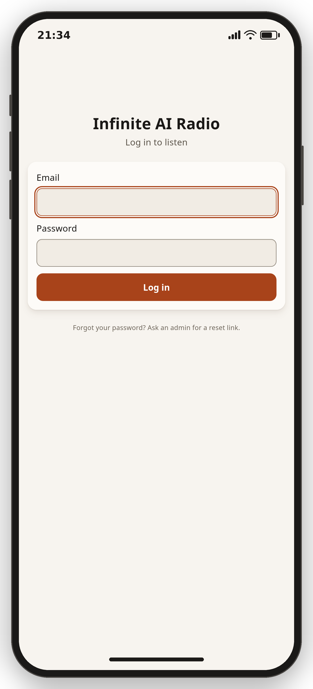
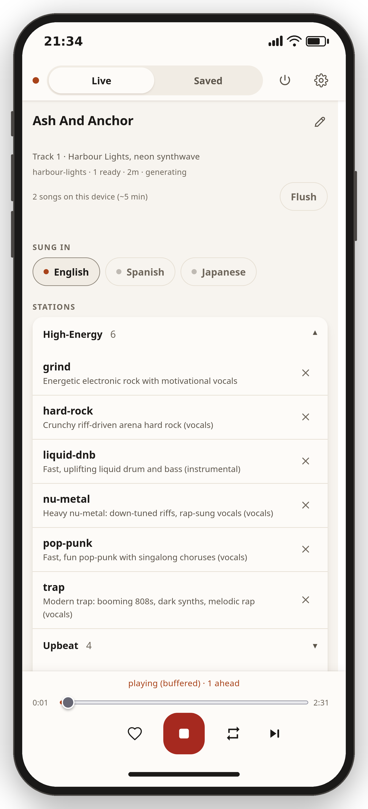
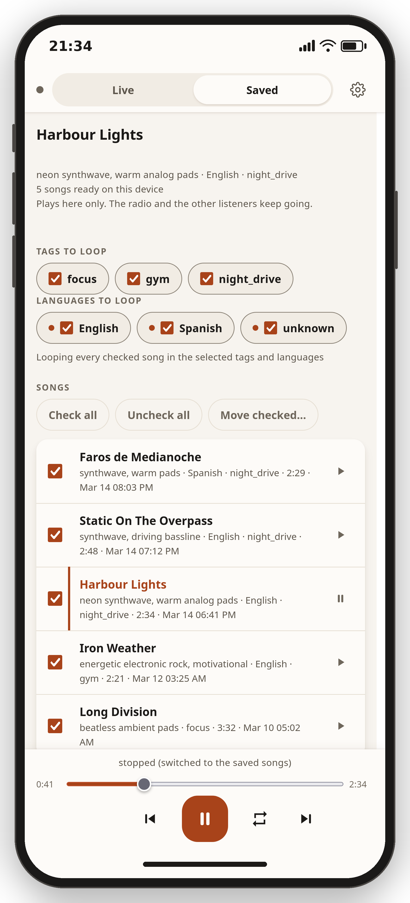

# Infinite AI Radio

Infinite AI Radio plays endless AI-generated music in your terminal,
running entirely on your own machine. Start it and music plays; type plain English while it
plays ("calmer", "add vocals about winning", "switch to piano") and the
stream follows. No cloud, no API keys, no subscriptions.

It is a single Go binary (`iar`) that manages everything else: it installs the
music model, supervises it, buffers generated tracks ahead of playback,
joins them with smooth crossfades, and keeps audio flowing even when the
generator hiccups. It is built for background listening: focus and study
music, ambient, sleep sounds, and an energetic vocal mode for workouts.

## Contents

- [Requirements](#requirements)
- [Install](#install)
- [Running](#running)
- [Starting from a prompt](#starting-from-a-prompt)
- [Steering the music](#steering-the-music)
- [Commands](#commands)
- [Sessions](#sessions)
- [Presets](#presets)
- [MP3 export](#mp3-export)
- [Saving tracks you like](#saving-tracks-you-like)
- [Listening from your phone](#listening-from-your-phone)
- [Accounts and permissions](#accounts-and-permissions)
- [Email setup](#email-setup)
- [Saved songs and tags](#saved-songs-and-tags)
- [Desktop integration](#desktop-integration)
- [What the music sounds like](#what-the-music-sounds-like)
- [Configuration](#configuration)
- [Models and licensing](#models-and-licensing)
- [Troubleshooting](#troubleshooting)
- [Known limitations](#known-limitations)
- [Development](#development)

## Requirements

- Linux with PipeWire or PulseAudio (the player uses `pw-play` or `pacat`).
  Other platforms are not supported yet.
- An NVIDIA GPU with 8 GB+ VRAM and a driver capable of CUDA 12.8 is
  strongly recommended for music generation. Without a GPU the music engine
  is impractically slow, but the noise modes (pink/white/brown) still work.
- About 20 GB of disk space for the engine and model weights.
- `ffmpeg` (with libmp3lame), `git`, and a C compiler for the engine's
  Python dependencies. `make deps` checks these and prints the exact
  install command for anything missing.
- Go 1.26+ to build.
- Optional: a local [Ollama](https://ollama.com) daemon. When present, the player
  uses it to refine steering and write lyrics; without it, a built-in
  deterministic path is used and everything still works.

## Install

```sh
make deps    # check system tools; prints sudo apt-get line if anything is missing
make build   # build the ./iar binary
make setup   # one-time: install the music engine and download models (~18 GB)
```

`make setup` is resumable: if the download is interrupted, run it again and
it continues where it stopped. It never uses sudo; everything lands in your
user directories. `make install` copies the binary to `~/.local/bin`.

## Running

```sh
./iar
```

That is all. Setup pre-generates a small library of starter tracks, so a
launch begins playing one within a few seconds and crossfades to freshly
generated music as soon as it is ready (each generation is independent,
so playing a banked track never changes what gets generated). While anything loads, Infinite AI Radio shows
live progress: which phase it is in, how long it has been running, and
how long it usually takes.

Behind the scenes the engine runs as a shared background process that
the radio wakes only when there is work to do: songs are planned and
rendered in batches to an on-disk buffer, and between batches the
engine shuts down completely, freeing all of its graphics and system
memory while playback continues from the buffer. A launch with banked
tracks makes audio in seconds; a fresh steering context has its first
new song in about a minute (a bit more when the engine was asleep).

Useful variants:

```sh
./iar "dark techno"           # start straight from a prompt
./iar --preset lofi-study     # start from a built-in preset
./iar --session gym-grind     # resume a saved session
./iar --engine noise          # noise only, no GPU needed
./iar --plain                 # line-based interface (also used automatically in pipes)
./iar presets                 # list the built-in presets
./iar doctor                  # check your environment
./iar engine status           # is the shared engine running and ready?
./iar engine stop             # stop the engine now and free GPU memory
```

Quit with `quit` (or Ctrl+C). Music generation runs a few times faster than
realtime on a modern GPU, so the stream stays ahead of playback.

The engine runs as a shared background process that sleeps whenever the
on-disk track buffer is comfortably ahead - which is most of the time -
and wakes for the next batch on its own. A relaunch with a healthy
buffer plays immediately without touching the graphics card at all.
Only one interactive Infinite AI Radio player runs at a time; a second
one tells you where the first is.

## Starting from a prompt

You do not need a preset; describe what you want:

```sh
./iar "dark techno"
./iar --prompt "energetic rock with vocals about winning"
```

Inside the player, `new <prompt>` drops the current steering context and
starts a fresh session seeded with the prompt (auto-persisted like any
session, name it with `name`). Vocal requests in the prompt work the
same way they do in steering.

## Steering the music

While music plays, just type what you want and press Enter:

```
make it more energetic
calmer
faster
switch to piano
add vocals about winning
no vocals
generate pink noise
```

Each input is acknowledged with how it was understood, and the player
switches to the newly steered sound as soon as the first track matching
it is generated; the old track never plays to its end after a steer,
and the acknowledgment estimates when the switch will be audible.

Steering has real semantics, not just word-appending:

- "less guitars" dials guitars down a notch without banishing them
  (repeat it to go further); "no drums" (or "without", "remove",
  "drop") removes the thing everywhere and tells the model to avoid it
  from then on; "more synths" (repeatable) raises the emphasis. The
  acknowledgments match: "dialing back guitars" versus "avoiding
  drums".
- Mood words replace their opposites: "calmer" also withdraws
  "energetic" if you asked for that earlier.
- "120 bpm", "faster", "slower", "in C minor", "3/4 time" and
  "vocals in Spanish" set tempo, key, meter and vocal language as hard
  constraints the engine honours directly.
- Repeating a request that is already in effect changes nothing (and
  says so) instead of churning the queue.

Steering accumulates: "calmer" then "no drums" gives you calm, drumless
music. `clear` wipes the accumulated steering and returns to the session's
base sound.

### Lyric writers

Vocal tracks get their words from a pluggable lyric writer; two are
built in:

- `scribe` (the default) plans each song before writing it: it pins
  the theme down to concrete images, gives every section its own job
  and its own rhyme sound, writes one section at a time, and checks
  every draft against a pronouncing dictionary - syllable counts,
  rhyme schemes, clichés, repetition budgets and theme coverage -
  sending specific corrections back for anything that fails. The
  chorus repeats because the song is assembled that way; nothing else
  gets to. The dictionary machinery is English-only: for any other
  sung language scribe writes in one pass, in that language.
- `smoothbrain` is the original writer: one quick prompt, no plan, no
  revision. Kept selectable for comparison.

`lyrics` shows the active writer and the options; `lyrics smoothbrain`
switches (the phone remote has the same switch under Settings). The
choice is saved with the session, and `lyrics_generator` in the
[configuration](docs/configuration.md) sets the default for new
sessions. Lyric writing runs through Ollama; without a daemon the
engine's own planner invents lyrics from the theme instead.

### Sung languages

Left alone, the music engine sings in whatever language it feels like,
which is fun until it is not. Name the languages you want and every
song picks one of them at random, so the same language can come up
twice in a row:

```
languages English, Russian, French, Bisaya (Cebuano)
languages              # what is configured, and what is switched on
languages -Russian     # not in the mood for Russian right now
languages +Russian
languages none         # back to the engine's own choice
```

The list is saved as `vocal_languages` in the
[configuration](docs/configuration.md), so it survives restarts and
preset switches. The phone remote shows one switch per language on its
Live screen, so narrowing the mix down to English is a single tap, and
edits the list itself under Settings.

The engine publishes a list of about fifty language tags, but it never
checks a request against it, and the model behind it knows more
languages than the list names. Cebuano is one of them: it is asked for
by its own tag and the words come back in Cebuano, even though the
published list has no Philippine language but Tagalog. Asking for
Tagalog instead would get Tagalog words - a different language, not a
Cebuano accent.

A language the engine has no tag for at all still works: the words are
written in it and sung with no language hint. That is best-effort
rather than a guarantee, and both the `languages` listing and the phone
remote say which languages are in that situation.

The tag matters more than it looks. On tracks where the engine writes
the words itself, it is the tag that decides which language they are
written in, so a wrong tag does not produce an accent - it produces a
different language.

Steering a language by hand ("sing in French") pins the session to it
and overrides the list; a preset that names a language of its own does
not. Editing the list or flipping a switch releases that pin, drops the
tracks queued ahead and starts generating in the new languages straight
away.

## Commands

Commands work with or without a leading slash, always with plain words and
Enter:

| Command | Effect |
| --- | --- |
| `clear` | wipe the steering context |
| `new <prompt>` | fresh session from a prompt |
| `save [prev] [tag]` | save the playing (or previous) track as MP3, filed under a tag |
| `name <name>` | save the current session under a name |
| `sessions` | list presets and saved sessions |
| `load <name>` | resume a saved session |
| `preset <name>` | switch to a built-in preset |
| `delete <name>` | delete a session or hide a preset (asks for confirmation) |
| `mp3 <minutes> [file]` | export minutes of the current vibe to MP3 |
| `skip` | jump to the next track |
| `pause` / `resume` | pause or continue output |
| `volume <0-100>` | set output volume |
| `lyrics [name]` | show or switch the lyric writer for vocal tracks |
| `languages [list]` | show, set or switch the languages vocals are sung in |
| `status` | engine, buffer and session status |
| `help` | list commands |
| `quit` | exit |

Longer output than fits on screen starts at its top with a "more below"
marker; PgUp/PgDn scroll the message backlog and End (or Esc) returns to
the live view.

## Sessions

Everything you type is persisted automatically; you never have to save.
Name the current session to make it easy to find again:

```
name gym-grind
```

Later, get the same vibe back with `./iar --session gym-grind` or `load
gym-grind` inside the app.

`./iar sessions` (or `sessions` inside the app) lists everything you can
start in three groups: your named sessions (most recently played
first), the built-in presets, and auto-saved sessions (newest first),
each with a short description and when it last played:

```
your sessions:
  gym-grind                energetic electronic rock, driving...  vocals   2h ago
presets:
  high-energy:
    grind                  Energetic electronic rock with motivation...
    nu-metal               Heavy nu-metal: down-tuned riffs, rap-sun...
  ...
auto-saved sessions:
  session-20260821-220425  lofi chill beats, mellow, warm analog... +2 tweaks  3d ago
```

Sessions you never named are removed automatically two days after they
last played (`sessions.auto_retention_days` in the config; `0` keeps
them forever). Named sessions, presets and the session that is playing
are never removed this way.

Delete a session, with a confirmation question:

```sh
./iar sessions delete gym-grind         # asks: Delete session gym-grind? [y/N]
./iar sessions delete gym-grind --yes   # no question, for scripts
```

Inside the app, `delete gym-grind` asks on the next line; `y` confirms,
anything else cancels. The session that is playing cannot be deleted.
Presets can be deleted as well: the preset disappears from every
listing and can no longer be started until `./iar sessions
restore-presets` brings all of them back. Session files are plain JSON
in your data directory.

## Presets

Twenty curated starting points ship built in, grouped by energy so you
can pick a feeling first and steer the genre later. They behave like
read-only sessions: starting from one seeds a fresh session you can
steer and name.

| Group | Preset | Sound |
| --- | --- | --- |
| high-energy | `grind` | energetic electronic rock with motivational vocals |
| | `hard-rock` | crunchy riff-driven arena hard rock (vocals) |
| | `liquid-dnb` | fast, uplifting liquid drum and bass |
| | `nu-metal` | heavy nu-metal: down-tuned riffs, rap-sung vocals |
| | `pop-punk` | fast, fun pop-punk with singalong choruses (vocals) |
| upbeat | `chiptune` | playful 8-bit video game energy |
| | `deep-house` | warm groovy deep house |
| | `funk-soul` | joyful 70s funk and soul with horns (vocals) |
| | `sunshine-pop` | bright feel-good pop with catchy hooks (vocals) |
| cruise | `boom-bap` | dusty 90s boom-bap hip-hop beats |
| | `epic-score` | heroic cinematic orchestra with choir |
| | `night-drive` | neon 80s synthwave for driving |
| | `reggae-dub` | sunny reggae with spacious dub delays (vocals) |
| | `roadhouse-country` | warm country rock for the open road (vocals) |
| chill | `chamber-strings` | elegant classical string quartet |
| | `deep-focus` | beatless ambient pads for deep concentration |
| | `jazz-club` | late-night jazz combo, warm and relaxed |
| | `lofi-study` | chill lofi hip hop beats for studying and working |
| sleep-noise | `pink-noise` | steady pink noise, no music |
| | `sleep` | slow beatless drones for falling asleep |

`./iar presets` lists them in the terminal. Select at launch
(`./iar --preset night-drive`) or inside the app (`preset night-drive`);
on the phone the picker shows the same groups, with the playing group
open.

## MP3 export

Render any amount of the current session's sound to a file you can copy to
a phone or player:

```
mp3 20
```

produces a ~20-minute MP3 (path printed, default in the exports directory).
The export runs in the background and never interrupts playback: it only
generates while the playback buffer is full. There is also a headless
subcommand:

```sh
./iar export --minutes 20 --preset sleep
./iar export --minutes 30 --session gym-grind --out ~/Music/grind.mp3
```

Exports are capped at 180 minutes per run.

## Saving tracks you like

When a track lands just right, type:

```
save
```

and the currently playing track is written as a high-quality MP3 into
the snippets folder, path shown in the acknowledgment. Its tags carry
the track's short title, a genre/mood line and (for vocal tracks) the
lyrics. `save prev` captures the previous track instead, for when it
clicks a moment too late. Saving never interrupts playback, and saving
the same track twice is a friendly no-op.

Add a tag to file the track where you will find it again:

```
save gym
save prev late night
```

Tags become folder names (`snippets/gym/`, `snippets/late_night/`;
anything that is not a letter, digit or underscore turns into an
underscore) and are also written to the MP3's album tag. Saves without
a tag go to `snippets/untagged/`, and tracks saved before tags existed
are moved there the next time the player starts. The phone remote's saved-songs player
loops these folders by tag (see [Saved songs and tags](#saved-songs-and-tags)).
The base folder is configurable via `snippets_dir`.

## Listening from your phone

Infinite AI Radio has a built-in web remote: a phone-first page with the
live stream, the now-playing state and the shared steering context (the
base sound plus every accumulated tweak, identical for every listener
and after every reload), a steering box with a lyric-writer switch, a
start-fresh action, a Next button, a session picker (save the current session under a name, load
any session or preset), save buttons with a tag field at the top of the
page, and a player for the tracks you have saved. Everything on it
needs a login, and the first account is created in the terminal:

```sh
./iar remote setup          # create the first admin (email + password, typed twice)
./iar --remote              # start as the station: remote on, local speakers at 0
```

With `--remote` the local speakers start at volume 0 (the machine is
the station, not the listening room); type `volume 80` in its terminal
to also hear it locally. Remote listeners always receive the
full-level stream either way.

(`remote.enabled` in the config keeps it on permanently.) The player
prints the URL to open; `iar doctor` shows it too under the remote
section. Open it on the phone, log in, tap play. The stream is MP3 at
~192 kbps and runs a few seconds behind the machine's speakers;
steering, starting fresh and saving act instantly and show up in the
terminal as well. Every button disables itself while its request is in
flight and reports success or failure right next to itself.

The connection looks after itself: if the stream drops or stalls (weak
signal, switching networks, the machine rebooting), the page
reconnects on its own with growing pauses, retries the instant
connectivity returns, and picks up the moment the stream is reachable
again; only an expired login stops it, with a message saying to log in
again. On phones the page defaults to **buffered playback**: it
downloads whole upcoming tracks ahead of time and plays them
back-to-back, so the music keeps going through minutes of dead signal
and steering still switches to the new sound as soon as its first
track is downloaded. A switch under **Settings** chooses between
buffered and the direct live stream; the direct stream is what
non-browser players (VLC, `mpv`) get from `/stream.mp3`.

How much is buffered is a per-device choice next to that switch,
with the banked minutes shown beside it:

- **Economical** downloads one track ahead and keeps only a few,
  for metered connections.
- **Automatic** (the default) downloads about two ahead on cellular or
  with data saving on, more on Wi-Fi, and keeps roughly 15-20 minutes.
- **Maximum** fills the device with about 45 minutes of audio
  (roughly 60-70 MB at the stream's quality) so long dead zones and
  flights stay covered.

In buffered mode the Next button skips only on that device: the
machine's speakers and other listeners keep their own position. Use
the direct stream's Next to skip the shared stream for everyone.

Saving from the phone always captures what YOU are hearing: in
buffered mode that is this device's playing track, which may trail the
machine's speakers. Save is the left button in the bottom bar; its
heart fills once that track is in your snippets, and saving it again
does nothing. Saves are filed under the tag set in Settings, where
"Save the previous track" also lives. Every
track carries a generated short title (an evocative two-to-four word
name) and a genre/mood line, which is what lock screens, saved-song
lists and car displays show instead of the raw prompt, along with a
"Track N" counter.

The page also publishes media-session metadata, so the phone's lock
screen, Bluetooth displays and car interfaces show what is playing
(short title, track number and genre line, artwork) with working play,
pause and next buttons. The remote can be installed as an app from the
browser menu ("Add to Home screen"); how much of its identity a car
display shows depends on the browser and is outside the page's
control.

### The layout

One screen, no page scrolling. The top bar holds a signal light, the
Live/Saved switch and Settings. The bottom bar holds Save, Play and
Skip, and never moves. Between them: what is playing - including the
language it is being sung in - the language switches when you have
configured any, and the station list - presets and your saved sessions
- where one tap on a row starts it. Steering and the current prompt sit
in a section you open when you want them; the words of the playing
track sit in a section below it that is open to begin with, since they
change with every track. Everything set once per device - buffered
playback, the car conveniences, the save tag, the lyric writer, the
language list - lives under Settings.

### Starting the audio

Browsers refuse to make sound on a page that has not been touched yet,
so a reload while listening cannot resume by itself the first time.
The page says "tap anywhere to start the audio" and the next tap
starts it - no need to find the play button. To skip that tap for
good, add the page to your home screen: an installed web app is
allowed to start audio on its own. That exemption needs the remote to
be served over HTTPS, so on a plain `http://` tailnet address the
one-tap start is the way it works. Firefox for Android also has a
per-site setting (Settings > Site settings > Autoplay > "Allow audio
and video"); Chrome and Opera for Android have no such setting.

Two conveniences are built for the car, both switchable under Settings
and remembered per device:

- **The previous-track button saves the track.** Car displays only
  offer the standard media buttons, and a web page cannot add a
  labelled "save" to them (the only way to get one would be a small
  native companion app). Since an endless generated stream has no
  meaningful "previous track", that button doubles as
  save-what-I-am-hearing: press it on the steering wheel, headset or
  car screen and the current track lands in your snippets, confirmed
  by a short "Saved:" flash in the track title. Be aware it captures
  every previous-track input, including a voice assistant's "previous
  song", and the button keeps its standard icon. Turning the toggle
  off removes the button from the car instead of leaving a dead one.
  In the saved-songs player, previous keeps its normal meaning.
- **Resume when the car reconnects.** When the car turns off (or the
  Bluetooth route drops), playback pauses and the page keeps the
  paused stream and its media notification alive. It resumes by itself
  when the car asks to play, when you open the page, or with one tap
  otherwise, and never on a timer, so a phone in a pocket stays
  silent. For hands-free resume, enable "Automatically resume media"
  in Android Auto's settings. Reloading the page while you were
  listening also picks playback straight back up.

<p>




</p>

For safety the remote binds only to localhost and, when the machine has
one, its Tailscale address; it never listens on your LAN or the internet
unless you add addresses to `remote.bind` in the config. The intended
setup is a private [Tailscale](https://tailscale.com) network between
your computer and phone:

1. Install Tailscale on the computer per the official Linux guide
   (`https://tailscale.com/download/linux`; installing and running
   `sudo tailscale up` needs sudo) and sign in.
2. Install the Tailscale app on the phone and sign in to the same
   account.
3. Run `./iar remote setup` once, then start `./iar --remote`.
4. Open the printed `http://100.x.y.z:8246` URL in the phone's browser,
   log in and tap play.

To also reach the remote on your home LAN (say your laptop is
192.168.1.20), add that address to `remote.bind`; the player keeps
listening on localhost and the tailnet as well, and addresses you bind
are automatically accepted in URLs:

```json
{ "remote": { "enabled": true, "bind": ["192.168.1.20"] } }
```

Then open `http://192.168.1.20:8246/` from any device on that network
and log in. `"bind": ["0.0.0.0"]` listens on every network the machine
is on.

Security notes, plainly:

- Logins happen over plain HTTP. Tailscale encrypts everything between
  the devices, so that is fine on the tailnet. On your home LAN a
  password travels in clear text to the laptop; that is your call for
  a network you trust. Never expose the port to the public internet
  without TLS in front of it (a reverse proxy with a certificate);
  behind such a proxy the login cookie is marked secure automatically.
- A login lasts 30 days of inactivity on that browser (it is a radio).
  Log out from the menu to end it early; changing or resetting a
  password logs every other device out.
- Failed logins are rate-limited per address and per account, and the
  page never reveals whether an email exists.
- The remote refuses requests whose Host or Origin is not localhost,
  your tailnet address, an address you bound, or an entry in
  `remote.allowed_hosts` (a cross-site and DNS-rebinding defense).

## Accounts and permissions

Every listener has an account: the email address is the login, and
only the account holder ever knows the password. The first admin is
made with `./iar remote setup`; after that everything happens on the
remote's **Users** page (visible to admins):

- **Adding a user** takes an email and four checkboxes. It produces an
  invitation link, shown with a Copy button (and emailed too if
  [email is set up](#email-setup)). Send it by text or chat; the person
  opens it, sees their email, chooses a password, and is logged in. The
  link works once and expires after 7 days. The invitee has to be able
  to reach the address in the link, so create it from a browser that is
  on the same route in (the tailnet address for tailnet users, the LAN
  address for LAN users).
- **Pending links** are listed with Regenerate (which invalidates the
  old link) and Revoke.
- **Permissions** are four independent switches per account: *admin*
  (manage users and links, delete sessions), *can steer*, *new prompts*
  (start a prompt, and load a session or preset, since both change what
  everyone hears), *can save* (save tracks, and save the current session
  under a name). Listening needs none of them. Admin does not imply the
  other three; an admin can tick them for themselves. The page only
  shows the controls an account may use, and the server refuses the
  rest either way.
- **Password reset**: an admin presses *Reset link* on the account. The
  link works once, expires after 24 hours, and the user chooses the new
  password themselves; every other login of that account ends.
- **Guard rails**: you cannot delete your own account, and the last
  admin can neither be deleted nor demoted.

Each user changes their own password on the **Account** page. Forgot it?
An admin hands you a reset link. If the only admin is locked out, run
`./iar remote setup` again with that email in the terminal: it resets the
password and restores every permission.

Accounts and login sessions are small JSON files under the data
directory (`remote/users.json`, `remote/sessions.json`), readable only
by your user. Logins, user changes and refused actions all show up in
the log.

## Email setup

Optional. With no email configured, you pass invitation and reset links
on yourself, and nothing is missing. If you would rather have them
emailed automatically as well, point `remote.smtp` at a mail provider:

```json
{ "remote": { "smtp": {
    "host": "smtp-relay.brevo.com", "port": 587, "tls": "starttls",
    "username": "your-login", "password": "your-smtp-key",
    "from": "radio@example.com" } } }
```

and check it with:

```sh
./iar remote test-email you@example.com
```

Providers with a free tier that works for this (re-checked August
2026; numbers change, so confirm on their pricing pages):

- [Brevo](https://www.brevo.com): 300 emails a day on the free plan,
  SMTP relay at `smtp-relay.brevo.com:587`.
- [Resend](https://resend.com): 3,000 emails a month (100 a day) free,
  SMTP at `smtp.resend.com:465` with `"tls": "tls"` (username
  `resend`, password is an API key).
- [Mailjet](https://www.mailjet.com): 200 a day (6,000 a month) free,
  SMTP relay at `in-v3.mailjet.com:587`.
- Gmail: `smtp.gmail.com:587` with an
  [app password](https://support.google.com/accounts/answer/185833)
  (requires 2-step verification on the Google account); about 500
  messages a day.

`"tls"` is `"starttls"` (default, port 587), `"tls"` (implicit TLS, port
465) or `"none"`. Keep the config file readable only by you when it
holds a password (`chmod 600`); `iar doctor` warns otherwise.

There is deliberately no "just send it from my computer" mode: mail sent
straight from a home connection is blocked by most ISPs and rejected or
spam-foldered by the big mailbox providers, so it would fail quietly
for exactly the people it is meant for. The links are the reliable path;
email is a convenience on top.

## Saved songs and tags

The remote's **Saved** mode plays the songs you have saved, entirely on
the phone: it never touches the live stream, other listeners, or the
laptop's speakers.

- Tick the tags and the languages you want (every tag and every sung
  language with at least one saved song is listed - songs from before
  languages were recorded show as *unknown*; all are selected to begin
  with) and the player loops through the checked songs forever.
- Every song row carries a checkbox: uncheck a song to skip it in the
  loop without deleting anything. *Check all* and *Uncheck all* work on
  the songs currently in view, and *Move checked…* regroups them under
  any tag - typing a new name creates a new group on the spot.
- A song row shows its title (full, wrapped - never cut off), genre
  line, language, tag, length and when it was saved, with a *Play* and
  a *Loop this one* button. Tapping the row itself opens the song's
  panel: the full lyrics, its details and file name, and buttons to
  *Download* the MP3 to this device, *Rename* it, *Move* it to another
  tag, or *Delete* it (with a confirmation; the file and its lyrics are
  removed from the server). Looping one song repeats it until you press
  *Back to looping the checked songs*.
- The built-in controls seek, pause and set volume as usual.
- The mode, tag, language and checkbox selections are remembered per
  browser.

Saving from the phone works like the terminal `save`: an optional tag
in the box next to the button, the song appears in the list a moment
later. On disk, a saved song's file is named after its title - in the
title's own script - with the sung language's tag before the extension
(`20260831-120000-tumutunaw-ang-selyo.tl.mp3`), and the full lyrics sit
next to the MP3 in a `.txt` with the same base name, so what you see in
the interface is what you can find in the folder.

## Desktop integration

Infinite AI Radio shows up as a regular media player (MPRIS) on the desktop bus, so
media keys, KDE's media controls, KDE Connect and `playerctl` all work:

```sh
playerctl --player iar play-pause
playerctl --player iar next
playerctl --player iar volume 0.5
playerctl --player iar metadata xesam:title
```

PipeWire/PulseAudio per-stream volume also works independently of the player
(the playback stream belongs to `pw-play`):

```sh
pactl set-sink-input-volume "$(pactl list sink-inputs \
  | awk '/^Sink Input #/{id=substr($3,2)} /application.name = "pw-play"/{print id; exit}')" 50%
```

## What the music sounds like

The default engine is ACE-Step 1.5, a full-song generation model.
Honestly, by style:

- **Lofi, electronic, and beat-driven music** is the strong suit:
  produced-sounding tracks with real instrument timbres, coherent rhythm
  and structure. This is what the model was made for.
- **Ambient and sleep material** works but the model is song-trained, so
  it sometimes injects rhythm or song structure where you wanted pure
  texture. The presets use "beatless, no drums" phrasing to counter this;
  occasional tracks still drift toward songhood. Steering ("more drone,
  no melody") helps.
- **Solo piano** comes out convincingly piano-like, though more "produced
  piano track" than "microphone in a quiet room".
- **Vocals** are genuinely supported: tracks come with sung lyrics in a
  pop/rock delivery, and the singing follows the written lyrics closely
  enough that speech recognition can transcribe most lines back. The
  occasional garbled word or artifact happens, especially on fast verses.
  The `grind` preset gives a fair picture of vocal quality. With Ollama
  installed the lyrics follow your theme closely; without it the engine's
  own planner writes them from a description (and typically picks its own
  track length while doing so).
- Every generation has some luck involved; a weak track is usually
  followed by a better one, and `skip` is always there.
- Tracks are loudness-normalized to a consistent level, and the whole
  pipeline is lossless (48 kHz WAV from the engine, raw PCM to your
  speakers); only exports and snippets are encoded, at top MP3 quality.
  The remaining quality ceiling is the model itself: `inference_steps`
  defaults to 12 (measurably more spectral detail than the model's
  quick-start 8, at no meaningful speed cost on a strong GPU) and can
  be raised to 20 for a little more brightness, but no setting turns
  the model into a mastering studio.

If you run [Ollama](https://ollama.com), the player uses it in the background to
refine steering (as structured, validated updates to the sound, never
free prose), enrich vague starting prompts, and write themed lyrics; it
never delays the music, and it quietly stops asking if the model is
slow or failing. Set `ollama.model` to pin a specific model; empty
picks the first installed one.

Track-to-track transitions are equal-power crossfades (about 3 seconds by
default), which suits continuous background listening.

## Configuration

Optional. The player reads a JSON config file (path shown by `iar doctor`,
usually `~/.config/iar/config.json`) with these defaults:

```json
{
  "engine": "acestep",
  "player": "auto",
  "track_seconds": 150,
  "crossfade_seconds": 3,
  "buffer_tracks": 6,
  "volume": 80,
  "bed_while_waiting": false,
  "pipe_latency_ms": 200,
  "normalize_loudness": true,
  "mp3_quality": 0,
  "snippets_dir": "",
  "library_max_mb": 600,
  "lyrics_generator": "scribe",
  "vocal_languages": [],
  "remote": {
    "enabled": false, "port": 8246, "bind": [], "allowed_hosts": [],
    "smtp": { "host": "", "port": 0, "username": "", "password": "", "from": "", "tls": "starttls" }
  },
  "sessions": { "auto_retention_days": 2 },
  "acestep": {
    "port": 0,
    "idle_minutes": 15,
    "lm_model_path": "",
    "lm_backend": "auto",
    "inference_steps": 12,
    "thinking": true
  },
  "ollama": {
    "enabled": true,
    "url": "http://127.0.0.1:11434",
    "model": ""
  }
}
```

See [docs/configuration.md](docs/configuration.md) for what each knob does.
Data lives under XDG paths (`~/.local/share/iar` by default); the
`IAR_DATA_DIR` and `IAR_CONFIG_DIR` environment variables relocate
everything, which is also how the test suite keeps clear of your real
state.

## Models and licensing

The code is MIT licensed. Model weights are never bundled with the player;
they are downloaded on demand from their publishers, and the default model
requires no account, token, or license click-through.

| Model | Used for | Weights license |
| --- | --- | --- |
| [ACE-Step 1.5](https://huggingface.co/ACE-Step/Ace-Step1.5) (default) | music generation | MIT |
| [ACE-Step 5Hz LM 0.6B](https://huggingface.co/ACE-Step/acestep-5Hz-lm-0.6B) (optional, auto-selected on smaller GPUs) | planning/lyrics inside the engine | MIT |

The ACE-Step model card states that generated music may be used
commercially. If you point the optional Ollama integration at a model of
your choice, that model's own license applies to it.

See [docs/models.md](docs/models.md) for more detail.

## Troubleshooting

`iar doctor` checks your environment: system tools, GPU, engine install,
and whether the engine API is responding. The structured log (path printed
by doctor) has the full story including the engine's own output.

Common cases:

- **"music engine not installed"**: run `make setup`.
- **No sound**: confirm `pw-play` or `pacat` exists and plays something;
  try `./iar --player pipe`.
- **First track takes long**: the initial model load takes a few minutes;
  the progress display shows which phase is running and how long it
  usually takes. While the engine stays warm (see `iar engine status`),
  later launches skip the load entirely.
- **Generation failures**: the stream degrades gracefully (buffer, then
  looping the last track, then a noise bed). The engine restarts itself
  after repeated failures, and instantly on known-fatal faults, even
  when its health endpoint still claims everything is fine; expect at
  most a couple of minutes of looped music while it reloads. The
  interface and `iar doctor` show the current failure streak and the
  last reason.
- **Buzz or static from the speakers while a track generates**: heavy
  GPU load can induce electrical interference in analog audio chains
  (laptop headphone out, unbalanced cables into a mixer) that sounds
  like cell-phone buzz and follows the GPU's duty cycle, not the audio
  data. Check the underrun counter in the interface header and in
  `iar doctor`: if it stays at zero while you hear the noise, the audio
  stream itself is clean and the interference is happening after the
  digital output. Mitigations that work: cap the GPU's power draw
  (`sudo nvidia-smi -pl <watts>`), use shielded or shorter audio
  cables, ground the laptop's power supply, or switch to a digital
  output (USB DAC/interface, HDMI audio).

## Known limitations

- Linux only for now, and playback expects PipeWire or PulseAudio.
- The music engine needs an NVIDIA GPU to be practical; CPU-only machines
  are limited to the noise modes.
- On gaming laptops, hours-long generation sessions can heat the GPU
  enough to throttle. Capping the GPU power limit (`nvidia-smi -pl`, needs
  root) noticeably reduces heat with little quality impact.
- A steering tweak is audible only once a track matching it has been
  generated; the player switches over the moment that track is ready,
  which with a warm engine typically means tens of seconds, not the end
  of the current track.
- Vocal lyrics are short and chorus-driven; this is a background-music
  tool, not a songwriting studio.
- The phone remote has no self-service password reset: an admin hands
  out reset links, and a locked-out sole admin recovers with
  `iar remote setup` in the terminal.
- Car integration works through the browser's media session, which
  offers only the standard buttons: the save mapping borrows the
  previous-track button and cannot change its icon, and how long a
  paused stream stays resumable after the car turns off depends on the
  phone's battery management, so an overnight stop may need one tap. A
  labelled in-car save button would need a native companion app.

## Development

```sh
make help          # list targets
make test          # unit tests (silent; no audio devices touched)
make smoke         # end-to-end test of the built binary (sandboxed, silent)
make browser-test  # the phone remote in headless Firefox (needs geckodriver, firefox, pactl)
make screenshots   # re-shoot the README's remote screenshots into assets/
make lint          # go vet + gofmt check
```

The test suite, smoke test and browser test never emit audible sound:
they use the null or file audio backends, sandboxed data directories,
and a temporary null audio sink for the browser.
